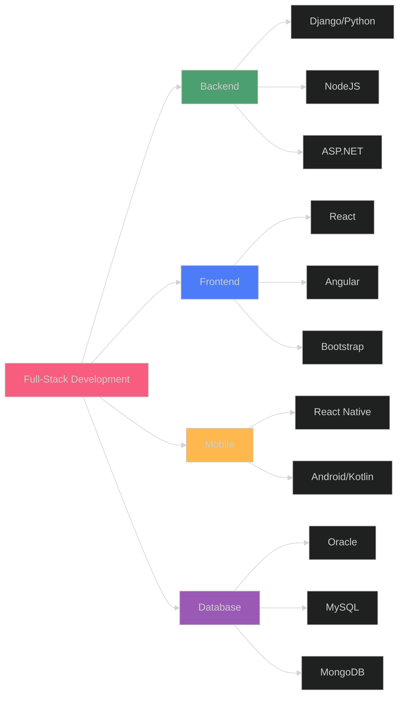

<div align="center">

# 👋 Hi, I'm Mohammad Habahbeh

### 💻 Full-Stack Developer | Oracle Specialist | 17+ Years Experience

[](mailto:habahbeh1000@gmail.com)
[](#)
[](#)

</div>

---

## 🚀 About Me

> **Experienced Software Developer and Oracle Programmer** with over **17 years** of expertise in full-stack development, database management, and enterprise application development. Specialized in building scalable web applications, mobile solutions, and complex enterprise systems for government and private sector.

- 🔭 Currently working as **Oracle Programmer** at General Budget Department (GBD)
- 🎓 Master's Degree in Computer Science from Zarqa University
- 💼 Extensive experience in **Django**, **Python**, **Oracle**, **React Native**, and **Full-Stack JavaScript**
- 🌱 Continuously learning and exploring **AI/Machine Learning** technologies
- 👨‍💻 Built enterprise systems including HR, Budget, Manpower, and IT Supplies Systems

---

## 🛠️ Tech Stack

### Programming Languages


### Frameworks & Libraries


### Databases


### Tools & Technologies


---

## 💼 Professional Experience

### 🏢 Oracle Programmer | General Budget Department (GBD)
**2008 - Present | Amman, Jordan**

- ⚙️ Develop and maintain enterprise applications using **Oracle Forms & Reports**
- 🏗️ Design and implement **HR System**, **Budget System**, **Manpower System**, and **IT Supplies System**
- 🗄️ Create complex database queries, stored procedures, and performance optimization
- 🤝 Collaborate with cross-functional teams to deliver government solutions
- 📚 Provide technical support and training to end-users

### 💻 Software Developer (Part-time) | Al-baheth Company
**Jan 2014 - Jun 2014 | Amman, Jordan**

- 🔧 Developed custom software solutions for diverse client requirements
- 🌐 Web application development and database integration
- 💡 Technical consulting and support services

---

## 🎯 Featured Projects

<table>
<tr>
<td width="50%">

### 💰 Payroll System - University of Petra
**Dec 2020 - Present**

- 🚀 Django web application with REST API
- 📊 Custom reporting system for payroll management
- 📱 Responsive design with Bootstrap & jQuery
- 📈 Data visualization with DataTable

</td>
<td width="50%">

### 🧬 Stem Cell Management System
**Dec 2020 - Present**

- 🖥️ Multi-platform (Windows, PHP, NodeJS)
- 📉 Comprehensive reporting & data visualization
- 🎨 Modern responsive interface
- 🔄 JSON data exchange

</td>
</tr>
<tr>
<td width="50%">

### 🌐 Sense Anywhere System (IoT)
**Apr 2021 - Jun 2021**

- 📡 IoT sensor management & control
- 📊 Real-time data visualization & dashboards
- 🔌 Django API integration
- ⚡ Interactive charts and monitoring

</td>
<td width="50%">

### 🛒 Munawaat Platform (E-commerce)
**Apr 2020 - Jun 2020**

- 🛍️ Full-featured e-commerce website
- 🐍 Built with Django framework
- 💳 Payment integration
- 📲 Mobile-responsive design

</td>
</tr>
<tr>
<td width="50%">

### 🍔 Foodjay Platform
**Mar 2020 - Oct 2020**

- 🚚 Food delivery web platform
- 👨‍🍳 Restaurant & order management
- 🎯 User-friendly interface
- 🌟 Modern web technologies

</td>
<td width="50%">

### 🎓 JLIF Management System
**Jan 2021 - Mar 2021**

- 🏆 Fellowship management platform
- 📝 Application tracking system
- 👥 User dashboard & reporting
- 🎨 Responsive Bootstrap design

</td>
</tr>
</table>

---

## 📊 GitHub Stats

<div align="center">


</div>

---

## 🏆 Expertise & Achievements

```text
Enterprise Systems       ████████████████████████░   95%
Full-Stack Development   ███████████████████████░░   92%
Database Management      ████████████████████████░   98%
Mobile Development       ████████████████████░░░░░   85%
API Development          ███████████████████████░░   90%
UI/UX Implementation     ██████████████████████░░░   88%
```

### 🎯 Core Competencies

- ✅ **17+ Years** of professional software development experience
- ✅ **Government Systems** - HR, Budget, Manpower, IT Supplies
- ✅ **Web Applications** - Django, ASP.NET, NodeJS
- ✅ **Mobile Apps** - React Native (iOS & Android), Kotlin
- ✅ **Database Expert** - Oracle (r11i, r12), MySQL, MongoDB
- ✅ **API Development** - RESTful APIs, JSON, AJAX
- ✅ **Enterprise Solutions** - Large-scale system architecture

---

## 📚 Education

🎓 **Master's Degree in Computer Science**
*Zarqa University* | 2023 - 2024

🎓 **Bachelor of Science in Computer Science**
*Al al-Bayt University* | 2004 - 2007

---

## 🌟 Key Projects Portfolio

| Project | Technology Stack | Duration | Type |
|---------|-----------------|----------|------|
| 💰 Payroll System (UOP) | Django, REST API, Bootstrap, jQuery | Dec 2020 - Present | Web App |
| 🧬 Stem Cell Management | PHP, NodeJS, Windows App | Dec 2020 - Present | Multi-platform |
| 📡 Sense Anywhere (IoT) | Django, API, Charts | Apr-Jun 2021 | Web App |
| 🛒 Munawaat E-commerce | Django, Bootstrap | Apr-Jun 2020 | Web App |
| 🍔 Foodjay Delivery | Django | Mar-Oct 2020 | Web App |
| 🎓 JLIF Platform | Django, Bootstrap | Jan-Mar 2021 | Web App |
| 📱 Financial Dictionary | Kotlin, Android | 2019 | Mobile App |
| 🏢 HR System (GBD) | Oracle Forms & Reports | 2008 - Present | Enterprise |
| 💼 Budget System (GBD) | Oracle Forms & Reports | 2008 - Present | Enterprise |
| 👥 Manpower System (GBD) | Oracle Forms & Reports | 2008 - Present | Enterprise |

---

## 📜 Professional Certifications & Training

<details>
<summary>🎯 Click to view all certifications</summary>

### Technical Training
- ✅ C#.NET Development
- ✅ PHP Development
- ✅ Oracle r11i & r12
- ✅ Crystal Report 10
- ✅ Microsoft .NET Framework 2.0 Web Application Track
- ✅ Interactive Websites Design, Development, and Administration

### Management & Soft Skills
- ✅ Project Management
- ✅ Performance Measurement Indicators Using Computer
- ✅ Manpower Tables Management
- ✅ Succession Planning
- ✅ IT Infrastructure Analysis and Engineering
- ✅ External Communication Strategies
- ✅ Basic Statistics & Data Analysis

</details>

---

## 💡 Core Skills & Values

<div align="center">

| 🎯 Professional Skills | 🌟 Personal Attributes |
|:----------------------|:----------------------|
| Team Collaboration | Deadline Driven |
| Problem Solving | Self-Starter |
| Code Quality | Detail Oriented |
| Technical Leadership | Continuous Learning |
| Requirements Analysis | Analytical Thinking |
| System Architecture | Adaptability |

</div>

---

## 📈 Technical Proficiency



---

## 🔥 Activity Graph


---

## 🤝 Let's Connect!

<div align="center">

[](https://linkedin.com/in/habahbeh)
[](https://github.com/habahbeh)
[](mailto:habahbeh1000@gmail.com)
[](https://wa.me/962776900900)

</div>

---

## 💬 Professional Philosophy

> *"Committed to delivering high-quality, scalable solutions that drive business value. With 17+ years of hands-on experience, I blend technical expertise with practical problem-solving to build systems that make a difference."*

---

<div align="center">

### ⚡ Fun Fact

**17 years** of coding experience | **10+** major enterprise systems | **Infinite** passion for technology

---


### 🌟 *"Building the future, one line of code at a time"* 🌟

---

**📍 Based in Amman, Jordan | 🕐 UTC+3**

*Last Updated: November 2024*

</div>
